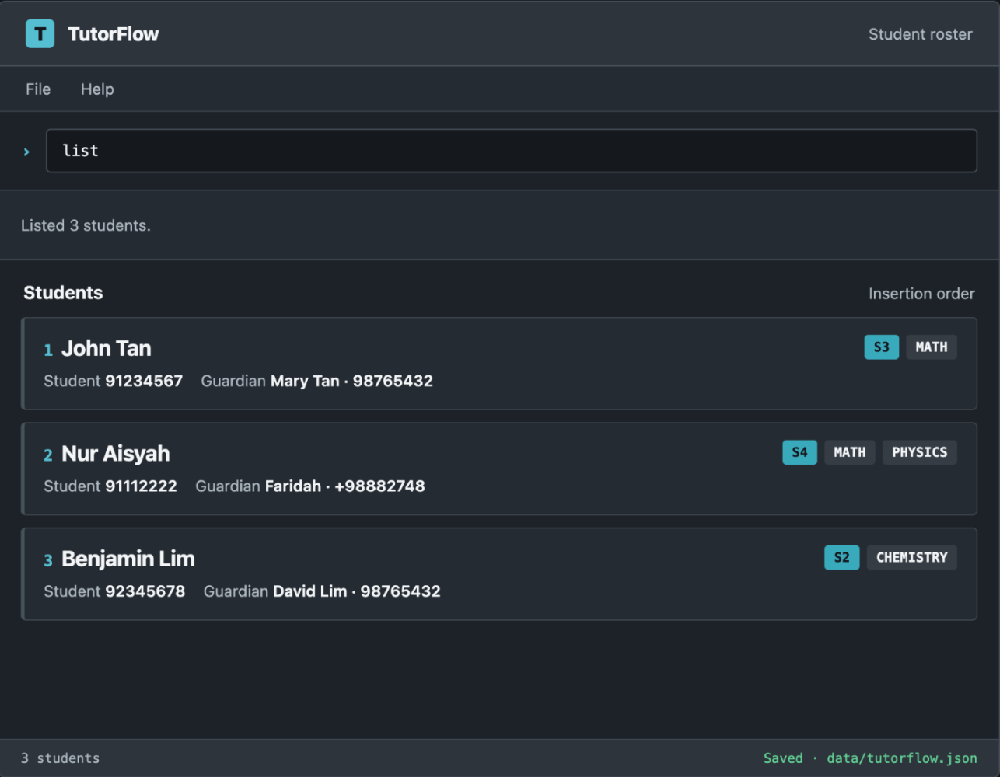

 

# TutorFlow

TutorFlow is a keyboard-friendly student-contact manager for independent tutors
in Singapore. It helps tutors organise student and guardian information, find
the right student quickly, and retain records between application sessions.

## Target users

TutorFlow is designed for independent part-time tutors who teach approximately
10 to 20 secondary or junior-college students through individual or small-group
lessons.

## Planned core features

* Add student profiles with student and guardian contact details, academic
  level, and tuition subjects.
* View the student roster.
* Delete a student profile.
* Save and restore student records automatically.
* Add regular lessons to a student profile.
* View all regular lessons.
* Delete regular lessons.

## Documentation

* [User Guide](docs/UserGuide.md)
* [Developer Guide](docs/DeveloperGuide.md)

## Acknowledgements

This project is based on the [AddressBook-Level3 project](https://github.com/se-edu/addressbook-level3)
created by the [SE-EDU initiative](https://se-education.org).
