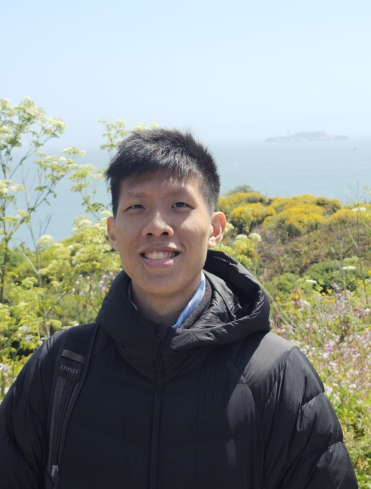
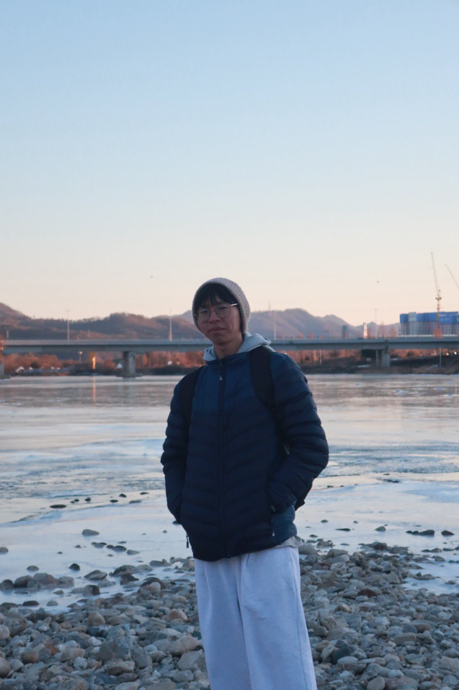
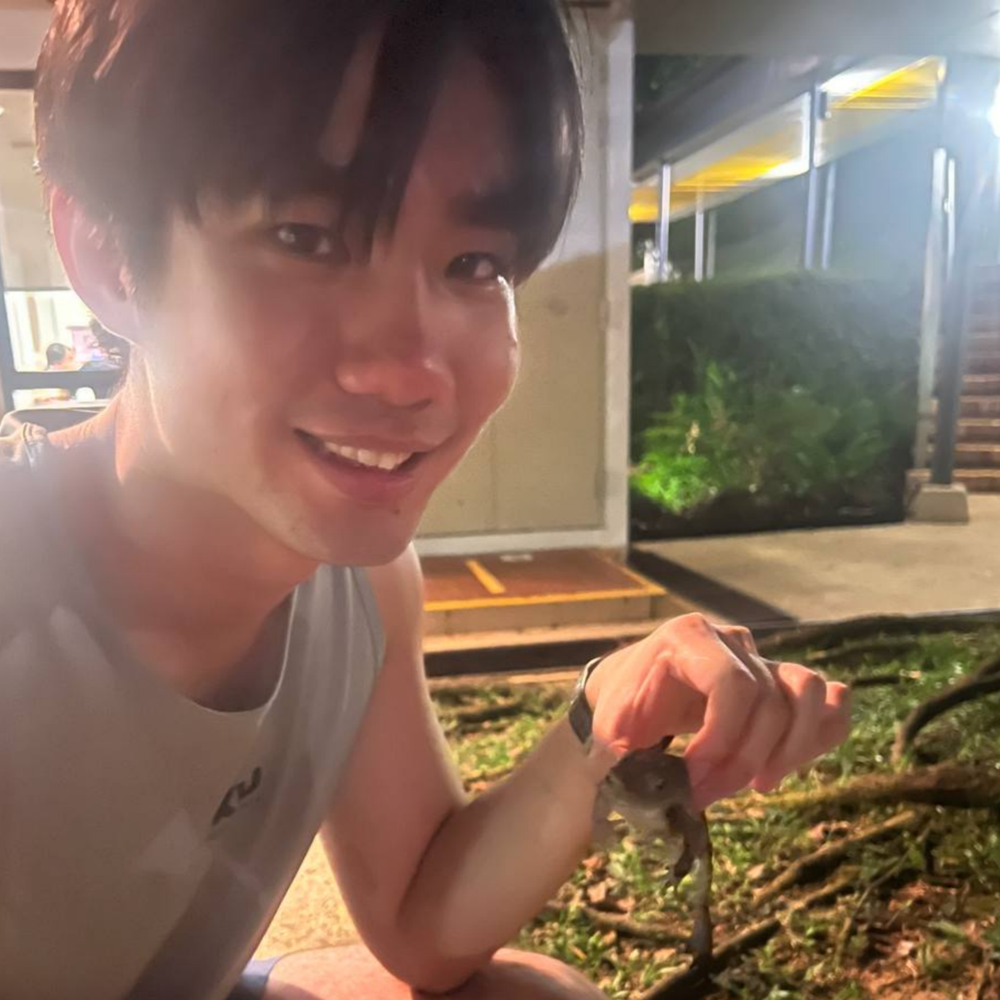

We are a team based in the [School of Computing, National University of Singapore](https://www.comp.nus.edu.sg).

You can reach us at the email `seer[at]comp.nus.edu.sg`

## Project team

### Alex Chien

[[github](https://github.com/alexc09)]

### Edison Choo

[[github](http://github.com/Edison-choo)]

* Role: Developer

### Lim Jing Kai

### Jean Doe

[[github](http://github.com/johndoe)]
[[portfolio](team/johndoe.md)]

* Role: Developer
* Responsibilities: Dev Ops + Threading

### Wee Wye Keong

[[github](http://github.com/wyekstudent)]

* Role: Developer
* Responsibilities: UI
