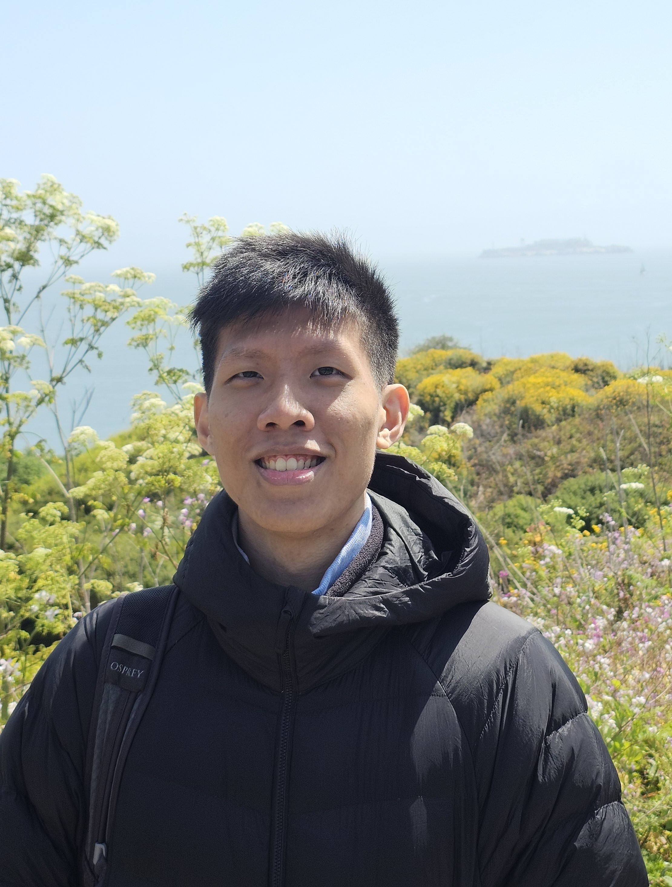
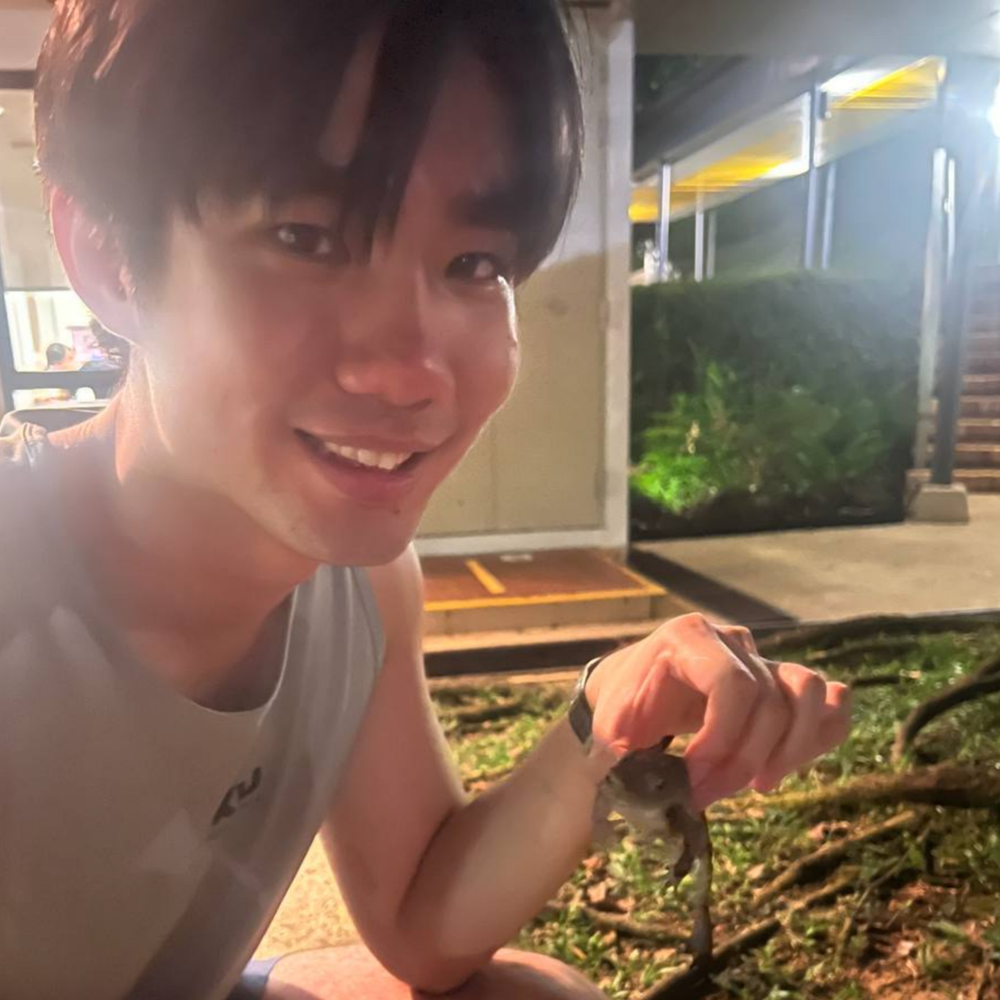

We are a team based in the [School of Computing, National University of Singapore](https://www.comp.nus.edu.sg).

You can reach us at the email `seer[at]comp.nus.edu.sg`

## Project team

### Alex Chien

[[github](https://github.com/alexc09)]

* Role: QA lead
* Responsibilities: Coordinate automated testing, CI checks, and regression checks.

### Edison Choo

[[github](http://github.com/Edison-choo)]

* Role: Documentation lead
* Responsibilities: Coordinate README, User Guide, and Developer Guide updates, and check their consistency.

### Lim Jing Kai

[[github](https://github.com/Elljaykei)]

* Role: Project and website lead
* Responsibilities: Track iteration tasks and keep the published website and repository settings current.

### Noel Tong

[[github](https://github.com/h0nh0nbaguette)]

* Role: DevOps and architecture lead
* Responsibilities: Maintain the build workflow and guide changes to core design and threading.

### Wee Wye Keong

[[github](http://github.com/wyekstudent)]

* Role: UI lead
* Responsibilities: Guide interface design, usability, and UI changes.
