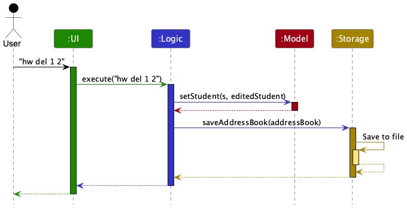
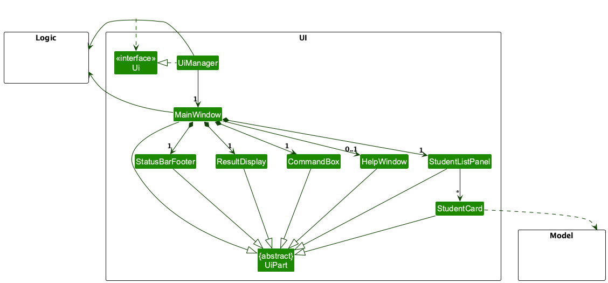
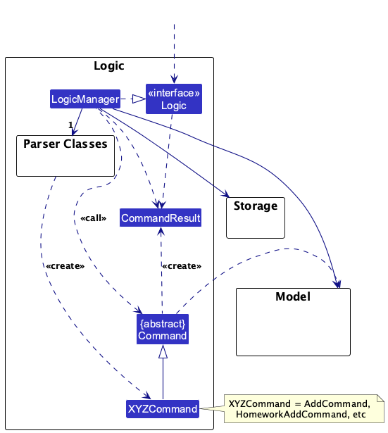
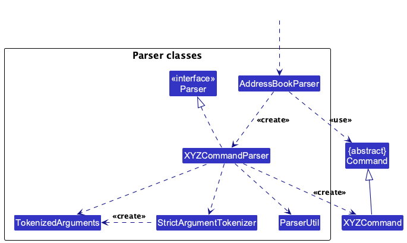
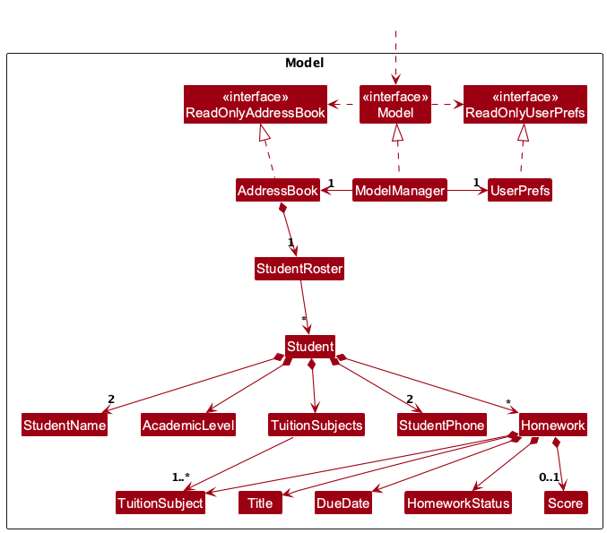
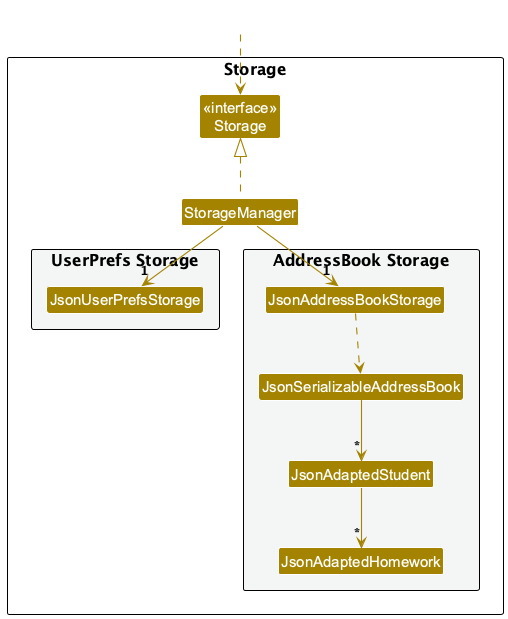

* Table of Contents
{:toc}

--------------------------------------------------------------------------------------------------------------------

## **Acknowledgements**

* _{List the sources of reused or adapted ideas, code, documentation, and third-party libraries here, with links to the originals.}_

--------------------------------------------------------------------------------------------------------------------

## **Setting up, getting started**

Refer to the guide [_Setting up and getting started_](SettingUp.md).

--------------------------------------------------------------------------------------------------------------------

## **Design**

:bulb: **Tip:** The `.puml` files used to create diagrams are in `docs/diagrams`. Refer to the [_PlantUML Tutorial_ at se-edu/guides](https://se-education.org/guides/tutorials/plantUml.html) to learn how to create and edit diagrams.

### Architecture

The ***Architecture Diagram*** given above explains the high-level design of the App.

The following provides a quick overview of the main components and their interactions.

**Main components of the architecture**

**`Main`** (consisting of classes [`Main`](https://github.com/se-edu/addressbook-level3/tree/master/src/main/java/seedu/address/Main.java) and [`MainApp`](https://github.com/se-edu/addressbook-level3/tree/master/src/main/java/seedu/address/MainApp.java)) is in charge of the app launch and shut down.
* At app launch, it initializes the other components in the correct sequence, and connects them up with each other.
* At shut down, it shuts down the other components and invokes cleanup methods where necessary.

The bulk of the app's work is done by the following four components:

* [**`UI`**](#ui-component): The UI of the App.
* [**`Logic`**](#logic-component): The command executor.
* [**`Model`**](#model-component): Holds the data of the App in memory.
* [**`Storage`**](#storage-component): Reads data from, and writes data to, the hard disk.

[**`Commons`**](#common-classes) represents a collection of classes used by multiple other components.

**How the architecture components interact with each other**

The *Sequence Diagram* below shows how the components interact with each other for the scenario where the user issues the command `hw del 1 2`.

Each of the four main components (also shown in the diagram above),

* defines its *API* in an `interface` with the same name as the Component.
* provides its functionality through a concrete `{Component Name}Manager` class that implements the corresponding API interface.

For example, the `Logic` component defines its API in `Logic.java` and implements it in `LogicManager.java`. Other components interact with a component through its interface rather than its concrete class, preventing them from coupling to that component's implementation, as illustrated in the following partial class diagram.

The sections below give more details of each component.

### UI component

The **API** of this component is specified in [`Ui.java`](https://github.com/se-edu/addressbook-level3/tree/master/src/main/java/seedu/address/ui/Ui.java)

The UI consists of a `MainWindow` and its parts, such as `CommandBox`, `ResultDisplay`, `StudentListPanel`, and `StatusBarFooter`. All of these, including `MainWindow`, inherit from the abstract `UiPart` class, which captures common behavior among classes that represent visible GUI parts.

The `HelpWindow` lists the commands from `HelpContent`, a plain Java class that groups the commands into sections. Each command format in `HelpContent` is the usage constant of the command (e.g. `HomeworkAddCommand.MESSAGE_USAGE`), so the help window shows the same format as the parser error messages, and `HelpContentTest` checks that every example in it parses into the listed command.

The `UI` component uses the JavaFX UI framework. The layouts of these UI parts are defined in matching `.fxml` files in `src/main/resources/view`. For example, [`MainWindow.fxml`](https://github.com/se-edu/addressbook-level3/tree/master/src/main/resources/view/MainWindow.fxml) specifies the layout of [`MainWindow`](https://github.com/se-edu/addressbook-level3/tree/master/src/main/java/seedu/address/ui/MainWindow.java).

The `UI` component,

* executes user commands using the `Logic` component.
* listens for changes to `Model` data so that the UI can be updated with the modified data.
* keeps a reference to the `Logic` component, because the `UI` relies on the `Logic` to execute commands.
* depends on some classes in the `Model` component because it displays `Student` objects from the model.

`MainWindow` shows one `StudentListPanel`, which lists every student as a `StudentCard`, and a `StatusBarFooter` that shows the path of the data file.

### Logic component

**API** : [`Logic.java`](https://github.com/se-edu/addressbook-level3/tree/master/src/main/java/seedu/address/logic/Logic.java)

Here's a (partial) class diagram of the `Logic` component:

The sequence diagram below illustrates the interactions within the `Logic` component, taking `execute("hw del 1 2")` API call as an example.

:information_source: **Note:** The lifelines for `HomeworkCommandParser` and `HomeworkDeleteCommandParser` should end at the destroy markers (X), but due to a limitation of PlantUML, they continue to the end of the diagram.

How the `Logic` component works:

1. When `Logic` is called upon to execute a command, the command is passed to an `AddressBookParser` object, which in turn creates a parser that matches the command (e.g., `HomeworkCommandParser`, which passes the rest of the command to `HomeworkDeleteCommandParser`) and uses it to parse the command.
1. This results in a `Command` object (more precisely, an object of one of its subclasses e.g., `HomeworkDeleteCommand`) which is executed by the `LogicManager`.
1. The command can communicate with the `Model` when it is executed (e.g. to add homework to a student). 
   Note that although this is shown as a single step in the diagram above for simplicity, the code can require several interactions between the command object and the `Model` to complete the operation.
1. If the command changed the data, `LogicManager` saves the data through the `Storage` component. Commands that leave the data unchanged, such as `homework list` and `help`, do not write the data file. If saving fails, `LogicManager` undoes the change (see [Saving after a command](#saving-after-a-command)).
1. The result of the command execution is encapsulated as a `CommandResult` object which is returned from `Logic`.

Here are the other classes in `Logic` (omitted from the class diagram above) that are used for parsing a user command:

How the parsing works:
* When called upon to parse a user command, the `AddressBookParser` class creates an `XYZCommandParser` (`XYZ` is a placeholder for the specific command name, e.g., `AddCommandParser`). The parser uses the other classes shown above to parse the user command and create an `XYZCommand` object (e.g., `AddCommand`). The `AddressBookParser` returns that object as a `Command` object.
* All `XYZCommandParser` classes, such as `AddCommandParser` and `HomeworkAddCommandParser`, implement the `Parser` interface so they can be treated similarly where appropriate, for example during testing.

### Model component
**API** : [`Model.java`](https://github.com/se-edu/addressbook-level3/tree/master/src/main/java/seedu/address/model/Model.java)

The `Model` component,

* stores all app data in an `AddressBook` object: the student roster (a `StudentRoster` of `Student` objects in insertion order), in which each `Student` holds its own `Homework` records. Lessons are not implemented yet; when they are, they can be added to `Student` or `AddressBook` in the same way.
* exposes the students as an unmodifiable `ObservableList<Student>` that the UI can observe and bind to, so the UI updates when the list changes. `ModelManager` passes every student operation (`hasStudent`, `addStudent`, `setStudent`, `getStudentList`) to its `AddressBook`.
* stores a `UserPrefs` object that represents the user’s preferences (currently, just the GUI settings). This is exposed to the outside as a `ReadOnlyUserPrefs` object.
* does not depend on any of the other three components (as the `Model` represents data entities of the domain, they should make sense on their own without depending on other components)

The classes keep AB3's names (`AddressBook`, `ReadOnlyAddressBook`, `JsonAddressBookStorage`) to keep the change from AB3 small, but they now hold TutorFlow's students and homework.

### Storage component

**API** : [`Storage.java`](https://github.com/se-edu/addressbook-level3/tree/master/src/main/java/seedu/address/storage/Storage.java)

The `Storage` component,
* can save both the app data (students and their homework) and user preference data in JSON format, and read them back into corresponding objects.
* is implemented by `StorageManager`, which delegates the actual JSON file access to `JsonAddressBookStorage` and `JsonUserPrefsStorage` (one class per data file).
* depends on some classes in the `Model` component (because the `Storage` component's job is to save/retrieve objects that belong to the `Model`)

The app data is saved in `data/tutorflow.json`. `JsonSerializableAddressBook` holds a `students` list of `JsonAdaptedStudent`, and each `JsonAdaptedStudent` holds a `homeworks` list of `JsonAdaptedHomework`. Jackson reads and writes the fields of these classes directly, so the JSON keys are the field names (`name`, `academicLevel`, `subjects`, `phone`, `guardianName`, `guardianPhone`, `homeworks`; and `title`, `subject`, `dueDate`, `status`, `score` for homework). Every value is a string, except `subjects` (a list of strings) and `score` (a whole number or `null`), so that a user can edit the file by hand.

Each adapted class checks its values in `toModelType()` with the same value classes that commands use, and throws an `IllegalValueException` with the `MISSING_FIELD_MESSAGE_FORMAT` message for a missing field or the value class's `MESSAGE_CONSTRAINTS` for an invalid one. Loading also rejects:

* a missing `students` list, or an empty (`null`) student or homework entry.
* two students that are the same by `Student#isSameStudent`.
* homework for a subject the student does not take, and two homework records of one student that are the same by `Homework#isSameHomework`.
* a due date that is not a full `YYYY-MM-DD` date. `JsonAdaptedHomework` uses `DueDate#parseFullDate`, so the year of a saved date is never inferred from today's date. Dates are saved padded (`2026-02-05`).
* a score that is not a JSON whole number within the `int` range (e.g. `85.5`, `"85"`), with `Score#MESSAGE_CONSTRAINTS`. `JsonAdaptedHomework` keeps `score` as the `Object` Jackson reads (an `Integer` only for such a whole number), because a field of type `Integer` would make Jackson silently truncate `85.5` to `85`.

A missing `homeworks` list or `score` means no homework or no score. Subjects, levels and statuses are accepted in any case and saved in upper case.

`MainApp#readInitialData` decides what the app starts with: the saved data if the data file is valid, the sample students from `SampleDataUtil#getSampleAddressBook()` if the data file does not exist (the file is not created at startup; the sample students are first saved by the first command that changes the data), and no students if the data file cannot be read or is invalid (a warning is logged). In the last case the invalid file stays on disk until the next command that changes the data overwrites it.

`FileUtil#writeToFile` saves a file atomically: it writes the content to a new temporary file with a unique name next to it (such as `tutorflow.json123456789.tmp`, created by `Files#createTempFile`) and then moves that file over the data file (an atomic move where the file system supports it). If writing fails, only that temporary file is deleted and the data file keeps its previous content, so it is never left partially written. Other files in the folder, even one named `tutorflow.json.tmp`, are never changed. Before the data is written to it, the temporary file gets the data file's POSIX file permissions or, on Windows, its access control list, so saving never changes who can read the data file. A read-only data file is reported as an `AccessDeniedException` before anything is written, because a move could otherwise replace it.

### Common classes

Classes used by multiple components are in the `seedu.address.commons` package.

--------------------------------------------------------------------------------------------------------------------

## **Implementation**

This section describes some noteworthy details on how certain features are implemented.

### Homework management

Homework is managed with three commands: `homework add`, `homework list` and `homework delete`. `hw` is an alias for `homework`.

**Parsing.** `AddressBookParser` passes the arguments of both `homework` and `hw` to `HomeworkCommandParser`. This dispatcher reads the first word as the subcommand and hands the rest to `HomeworkAddCommandParser` (`add`), `HomeworkListCommandParser` (`list` or `ls`) or `HomeworkDeleteCommandParser` (`delete` or `del`). A missing or unknown subcommand produces an "Invalid command format." error that lists the usage of all three subcommands. Usage messages show alternatives (aliases and the short date form) separated by `|`, e.g. `homework|hw list|ls STUDENT_INDEX`. This keeps one `AddressBookParser` case per command word, and future subcommands (edit, status, score; their classes exist as placeholders) only need a new case in the dispatcher.

The subcommand parsers use `StrictArgumentTokenizer`, which rejects unknown and repeated prefixes, and `ParserUtil#parseStrictIndex`, which rejects signs and leading zeroes. They use `StrictArgumentTokenizer` with plain string prefixes instead of AB3's `ArgumentTokenizer` with `CliSyntax` prefixes (both since removed) because the specification requires unknown prefixes to be rejected, which `ArgumentTokenizer` cannot do: it only splits on prefixes it is given, so an unknown prefix silently becomes part of the previous value. `StudentAddParser` shares the same tokenizer for the same reason. `HomeworkAddCommandParser` reports only the first error it finds, in this order:

1. An unknown or repeated prefix, in the order the prefixes appear.
1. Both `title/` and `t/` given, reported as a repeated `title/`. This is checked only after all prefixes are tokenized, so an unknown or repeated prefix anywhere in the input is reported first. For example, `t/A title/B x/C` reports an invalid command format because of `x/`.
1. A student index that is missing or is not a single word.
1. Missing prefixes, all listed in the order `title/, s/, due/`.
1. Student index syntax.
1. The title, then the subject, then the due date.

**Model.** `Student` is immutable and holds its `Homework` records in insertion order. To add or delete homework, a command copies the student's homework list, changes the copy, and calls `Model#setStudent(target, target.withHomeworks(updatedList))`, which replaces the student at the same position in the roster. The change to the observable student list refreshes the student card, which shows `Student#getAssignedHomeworkCount()`. `homework list` is read-only and returns the list as text in the result display, one line per record in the format of `HomeworkListCommand#MESSAGE_HOMEWORK_LINE` (e.g. `1. Complete algebra worksheet (MATH) - due 2026-10-15`).

The student index refers to `Model#getStudentList()`. The homework index is the one-based position in that student's homework list; it is not stored and changes when earlier homework is deleted. Two homework records of the same student are duplicates when `Homework#isSameHomework` holds: same title ignoring case, same subject and same due date.

**Due date forms.** A due date is given as `YYYY-MM-DD` or `MM-DD`, and in both forms the month and day may have 1 or 2 digits (`2026-2-5`, `10-5`). `DueDate` matches each form with a regular expression that allows only 4-digit years and 1- or 2-digit months and days, then builds the date with `LocalDate#of`, which rejects dates that do not exist (such as `2-30`). The stored date is a `LocalDate`, so it is always shown padded (`2026-02-05`), and `10-5` and `10-05` give equal due dates.

**Year inference.** For a due date given as `MM-DD`, `DueDate#parse(rawDate, today)` picks this year, or next year if the date has passed. If the date does not exist this year (29 February in a non-leap year), next year is used; if it does not exist next year either, the date is invalid. A next year after 9999 is also invalid. `HomeworkAddCommandParser` holds a `java.time.Clock` (`Clock.systemDefaultZone()` in production) and computes `today` as `LocalDate.now(clock)`, so tests pass a fixed clock and never depend on the real date. The parser tells `HomeworkAddCommand` whether the year was inferred, so the success message can show it.

**Unexpected errors.** Each homework command catches any unexpected `RuntimeException` in `execute`, logs it with its stack trace, and throws a `CommandException` with a short internal-error message instead, so the user never sees a stack trace. `Model#setStudent` is the last step of `homework add` and `homework delete`, so such an error leaves the student's homework unchanged.

**Persistence.** Homework is saved as part of each student (see [Storage component](#storage-component)). `homework add` and `homework delete` change the data, so `LogicManager` saves it after them; `homework list` changes nothing and never writes the data file. If saving fails, the change is undone and the error message is the one from the specification, e.g. `HomeworkAddCommand#MESSAGE_SAVE_FAILURE` ("The homework could not be added because TutorFlow could not save the updated data. No homework data was changed."), as described in [Saving after a command](#saving-after-a-command).

#### Design considerations:

**Aspect: Where homework is stored:**

* **Alternative 1 (current choice):** Each `Student` holds its own homework list.
  * Pros: A student and their homework stay together, and a student index plus a homework index identify one record without separate homework IDs.
  * Cons: Every change to homework builds a new `Student`.

* **Alternative 2:** One homework list in the model, with each record referring to its student.
  * Pros: Easy to show all homework across students.
  * Cons: Homework must be kept consistent when a student is edited or deleted, and per-student indices must be computed.

### Adding regular lessons

`lesson add INDEX s/SUBJECT d/DAY st/START_TIME et/END_TIME` is routed by `LessonCommandParser` to `LessonAddCommandParser`. The parser reuses `StrictArgumentTokenizer` and strict student-index parsing. `RegularLesson` stores a subject, `DayOfWeek`, and two minute-precision `LocalTime` values, with end strictly after start.

`LessonAddCommand` checks the selected student's subjects and duplicate lessons before checking overlaps across the entire roster. Overlap uses `start < other.end && end > other.start` on the same weekday, allowing adjacent lessons. The command replaces the selected immutable `Student` using `withLessons`, preserving homework and roster order. Homework updates using `withHomeworks` likewise preserve lessons.

`JsonAdaptedLesson` stores the four lesson fields inside each student's `lessons` array. A missing array is read as empty so existing data files remain compatible. Loading rejects invalid lesson fields, subject mismatches, duplicates and overlapping schedules. The existing `LogicManager` change detection and save rollback apply to lessons because `Student.equals` includes its lessons. The command supplies the lesson-specific save-failure message.

Lesson listing and deletion are separate increments owned by Noel. They can use `Student.getLessons()` and `Student.withLessons()` without changing this storage format.

Manual check: add a MATH student, run `lesson add 1 s/MATH d/MONDAY st/16:00 et/18:00`, and restart. Inspect `data/tutorflow.json` to confirm that the lesson remains. Try the same lesson again, an overlapping slot, and an adjacent slot; the first two should fail and the last should succeed. With the data file read-only, a new lesson should fail without changing either the file or the in-memory lessons.

### Saving after a command

`LogicManager#execute` saves the data after each command that changes it, and undoes the change if the data cannot be saved, so the data shown in the app always matches the data file.

1. Before executing the command, `LogicManager` copies the current data: `new AddressBook(model.getAddressBook())`. The copy is cheap because `Student` and `Homework` are immutable, so only the list is copied.
1. After the command succeeds, `LogicManager` compares the data with the copy. If they are equal, the command changed nothing (e.g. `homework list`, `help`, `exit`, or `clear` with no students), and nothing is saved.
1. Otherwise, `LogicManager` calls `Storage#saveAddressBook`. If this throws an `IOException`, `LogicManager` restores the copy with `Model#setAddressBook` and throws a `CommandException` whose message comes from `Command#getSaveFailureMessage(defaultMessage)`.
1. By default, `getSaveFailureMessage` returns the AB3 message (`LogicManager#FILE_OPS_ERROR_FORMAT`, or `FILE_OPS_PERMISSION_ERROR_FORMAT` when access is denied). `HomeworkAddCommand` and `HomeworkDeleteCommand` override it to return the messages from the specification. A new command that needs its own message only overrides this method.

#### Design considerations:

**Aspect: When to save:**

* **Alternative 1 (current choice):** Save only when the command changed the data.
  * Pros: Read-only commands such as `homework list` never write the data file, as the specification requires, and cannot fail because of a save error.
  * Cons: Each command copies and compares the data. This is fast for the number of students one tutor has.

* **Alternative 2 (AB3):** Save after every successful command.
  * Pros: Simpler.
  * Cons: A read-only command can fail with a save error, and it rewrites the data file even though nothing changed.

**Aspect: How to handle a failed save:**

* **Alternative 1 (current choice):** Undo the change by restoring the copy taken before the command.
  * Pros: Works for every command without command-specific undo code, and the app never shows data that is not in the data file.
  * Cons: The copy is taken even when saving succeeds.

* **Alternative 2 (AB3):** Report the error but keep the change in memory.
  * Pros: No copy is needed.
  * Cons: The message says the data could not be saved, but the change is still shown and is lost when the app closes, so the user cannot tell what is saved.

### \[Proposed\] Undo/redo feature

#### Proposed Implementation

The proposed undo/redo mechanism is facilitated by `VersionedAddressBook`. It extends `AddressBook` with an undo/redo history, stored internally as an `addressBookStateList` and `currentStatePointer`. Additionally, it implements the following operations:

* `VersionedAddressBook#commit()` — Saves the current address book state in its history.
* `VersionedAddressBook#undo()` — Restores the previous address book state from its history.
* `VersionedAddressBook#redo()` — Restores a previously undone address book state from its history.

These operations are exposed in the `Model` interface as `Model#commitAddressBook()`, `Model#undoAddressBook()` and `Model#redoAddressBook()` respectively.

Given below is an example usage scenario and how the undo/redo mechanism behaves at each step.

Step 1. The user launches the application for the first time. The `VersionedAddressBook` will be initialized with the initial address book state, and the `currentStatePointer` pointing to that single address book state.

Step 2. The user executes `delete 5` command to delete the 5th person in the address book. The `delete` command calls `Model#commitAddressBook()`, causing the modified state of the address book after the `delete 5` command executes to be saved in the `addressBookStateList`, and the `currentStatePointer` is shifted to the newly inserted address book state.

Step 3. The user executes `add n/David …​` to add a new person. The `add` command also calls `Model#commitAddressBook()`, causing another modified address book state to be saved into the `addressBookStateList`.

:information_source: **Note:** If a command fails its execution, it will not call `Model#commitAddressBook()`, so the address book state will not be saved into the `addressBookStateList`.

Step 4. The user now decides that adding the person was a mistake, and decides to undo that action by executing the `undo` command. The `undo` command will call `Model#undoAddressBook()`, which will shift the `currentStatePointer` once to the left, pointing it to the previous address book state, and restores the address book to that state.

:information_source: **Note:** If the `currentStatePointer` is at index 0, pointing to the initial AddressBook state, then there are no previous AddressBook states to restore. The `undo` command uses `Model#canUndoAddressBook()` to check if this is the case. If so, it will return an error to the user rather
than attempting to perform the undo.

The following sequence diagram shows how an undo operation goes through the `Logic` component:

:information_source: **Note:** The lifeline for `UndoCommand` should end at the destroy marker (X), but due to a limitation of PlantUML, it continues to the end of the diagram.

Similarly, how an undo operation goes through the `Model` component is shown below:

The `redo` command does the opposite — it calls `Model#redoAddressBook()`, which shifts the `currentStatePointer` once to the right, pointing to the previously undone state, and restores the address book to that state.

:information_source: **Note:** If the `currentStatePointer` is at index `addressBookStateList.size() - 1`, pointing to the latest address book state, then there are no undone AddressBook states to restore. The `redo` command uses `Model#canRedoAddressBook()` to check if this is the case. If so, it will return an error to the user rather than attempting to perform the redo.

Step 5. The user then decides to execute the command `list`. Commands that do not modify the address book, such as `list`, will usually not call `Model#commitAddressBook()`, `Model#undoAddressBook()` or `Model#redoAddressBook()`. Thus, the `addressBookStateList` remains unchanged.

Step 6. The user executes `clear`, which calls `Model#commitAddressBook()`. Since the `currentStatePointer` is not pointing at the end of the `addressBookStateList`, all address book states after the `currentStatePointer` will be purged. Reason: It no longer makes sense to redo the `add n/David …​` command. This is the behavior that most modern desktop applications follow.

The following activity diagram summarizes what happens when a user executes a new command:

#### Design considerations:

**Aspect: How undo & redo execute:**

* **Alternative 1 (current choice):** Saves the entire address book.
  * Pros: Easy to implement.
  * Cons: May have performance issues in terms of memory usage.

* **Alternative 2:** Individual command knows how to undo/redo by
  itself.
  * Pros: Will use less memory (e.g. for `delete`, just save the person being deleted).
  * Cons: We must ensure that the implementation of each individual command is correct.

_{more aspects and alternatives to be added}_

### \[Proposed\] Data archiving

_{Explain here how the data archiving feature will be implemented}_

--------------------------------------------------------------------------------------------------------------------

## **Documentation, logging, testing, dev-ops**

* [Documentation guide](Documentation.md)
* [Testing guide](Testing.md)
* [Logging guide](Logging.md)
* [DevOps guide](DevOps.md)

--------------------------------------------------------------------------------------------------------------------

## **Appendix: Requirements**

### Product scope

**Target user profile**:

* is an independent part-time tutor in Singapore
* teaches approximately 10 to 20 secondary or junior-college students through individual lessons
* needs to manage student details, guardian contact details, academic information, and regular lesson schedules
* prefers a desktop application that can be operated efficiently using the keyboard
* is reasonably comfortable using command-line interfaces

**Value proposition**: TutorFlow helps independent tutors manage student information and regular lesson schedules faster and more reliably than scattered notes, while reducing the risk of timetable clashes.

### User stories

Priorities: High (must-have) - `* * *`, Medium (should-have) - `* *`, Low (nice-to-have) - `*`

| ID | Priority | As a/an | I want to | So that I can |
| --- | --- | --- | --- | --- |
| US01 | `* * *` | independent tutor | add a student profile | keep the student's essential information in one place |
| US02 | `* * *` | independent tutor | list all my students | review my current student roster |
| US03 | `* * *` | independent tutor | view a student's profile | retrieve the student's contact and academic information |
| US04 | `* * *` | independent tutor | delete a student record | remove obsolete or incorrectly created records from my roster |
| US05 | `* * *` | independent tutor | add a regular lesson to a student | record when I teach that student each week |
| US06 | `* * *` | independent tutor | view the regular lessons assigned to a student | check that student's regular lesson schedule |
| US07 | `* * *` | independent tutor | view all regular lessons in weekday-and-time order | understand my overall teaching schedule |
| US08 | `* * *` | independent tutor | delete a regular lesson | remove lessons that no longer take place |
| US09 | `* * *` | independent tutor | be prevented from adding an overlapping regular lesson | avoid double-booking myself |
| US10 | `* * *` | independent tutor | reopen TutorFlow and recover my student and lesson records | avoid entering them again |
| US11 | `* *` | independent tutor | search for a student by name | find the student's record quickly |
| US12 | `* *` | independent tutor | filter students by academic level | focus on students at a particular stage of study |
| US13 | `* *` | independent tutor | filter students by subject | find the students whom I teach a particular subject |
| US14 | `* *` | independent tutor | view regular lessons scheduled on a selected weekday | focus on one day's teaching schedule |
| US15 | `* *` | independent tutor | edit a student's profile | correct changed or incorrectly entered information |
| US16 | `* *` | independent tutor | change a regular lesson's timeslot | keep my schedule accurate when a regular arrangement changes |
| US17 | `*` | independent tutor | archive an inactive student | keep former students from cluttering my current roster |
| US18 | `*` | independent tutor | restore an archived student | resume managing a returning student |
| US19 | `*` | independent tutor | identify students without a regular lesson | notice students whose schedules are incomplete |
| US20 | `*` | independent tutor | export my regular lesson schedule | view or print it outside TutorFlow |
| US21 | `*` | independent tutor | sort students alphabetically | scan my roster more easily |
| US22 | `*` | independent tutor | sort students by academic level | group students at similar stages of study |
| US23 | `*` | independent tutor | search for a student by phone number | identify a student from an unfamiliar contact number |
| US24 | `*` | independent tutor | view available periods in my regular lesson schedule | propose lesson times without checking each lesson manually |
| US25 | `*` | independent tutor | add homework to a student | record the work assigned to that student |
| US26 | `*` | independent tutor | view and filter homework by student, due date, subject, or completion status | find homework that requires my attention |
| US27 | `*` | independent tutor | edit recorded homework | correct or update an assignment's details |
| US28 | `*` | independent tutor | delete recorded homework | remove assignments entered incorrectly or no longer required |
| US29 | `*` | independent tutor | update a homework assignment's completion status | track which assignments remain unfinished |
| US30 | `*` | independent tutor | record a student's homework score | keep track of the student's performance |

### Use cases

For all use cases below, the **System** is `TutorFlow` and the **Actor** is the `Tutor`, unless specified otherwise.

#### Use case: UC01 - Add a regular lesson

**MSS**

1. Tutor requests to view the student roster.
2. TutorFlow displays the student roster with displayed indices.
3. Tutor requests to add a regular lesson to a displayed student, specifying the subject, weekday, start time, and end time.
4. TutorFlow records the regular lesson and confirms its details.
5. Use case ends.

**Extensions**

* 2a. The student roster is empty.
  * 2a1. TutorFlow informs the tutor that there are no students.
  * 2a2. Use case ends.
* 3a. The supplied student index does not identify a displayed student.
  * 3a1. TutorFlow displays an error.
  * 3a2. Use case resumes at step 3.
* 3b. One or more lesson details are invalid.
  * 3b1. TutorFlow displays the relevant validation error.
  * 3b2. Use case resumes at step 3.
* 3c. The selected student is not registered for the supplied subject.
  * 3c1. TutorFlow rejects the lesson and displays an error.
  * 3c2. Use case resumes at step 3.
* 3d. The regular lesson already exists.
  * 3d1. TutorFlow informs the tutor that the lesson already exists.
  * 3d2. Use case ends.
* 3e. The lesson overlaps another regular lesson on the same weekday.
  * 3e1. TutorFlow rejects the new lesson and identifies the conflicting lesson.
  * 3e2. Use case ends.
* 4a. TutorFlow cannot save the updated data.
  * 4a1. TutorFlow leaves the lesson schedule unchanged.
  * 4a2. TutorFlow informs the tutor that no lesson data was changed.
  * 4a3. Use case ends.

#### Use case: UC02 - Delete a regular lesson

**MSS**

1. Tutor requests to view all regular lessons.
2. TutorFlow displays the regular lessons in weekday-and-time order with displayed indices.
3. Tutor requests to delete a lesson using its displayed index.
4. TutorFlow deletes the selected lesson and confirms its details.
5. Use case ends.

**Extensions**

* 2a. There are no regular lessons.
  * 2a1. TutorFlow informs the tutor that no regular lessons were found.
  * 2a2. Use case ends.
* 3a. The supplied index does not identify a displayed lesson.
  * 3a1. TutorFlow displays an error.
  * 3a2. Use case resumes at step 3.
* 4a. TutorFlow cannot save the updated data.
  * 4a1. TutorFlow leaves the lesson schedule unchanged.
  * 4a2. TutorFlow informs the tutor that no lesson data was changed.
  * 4a3. Use case ends.

### Non-Functional Requirements

1. TutorFlow should work on Windows, Linux, and macOS on a computer with Java `25` installed.
2. TutorFlow should be distributed as a single JAR file no larger than 100 MB and should not require an installer or any additional software beyond Java 25.
3. TutorFlow should support one user, with its data file used only by that user during regular operation.
4. TutorFlow should store all application data locally in a human-editable UTF-8 text file and should not require a database management system.
5. TutorFlow's core student and lesson-management features should work without an Internet connection or a team-maintained remote server.
6. TutorFlow's GUI should work without inconvenience at resolutions of 1920x1080 or higher with 100% or 125% display scaling, and remain usable at resolutions of 1280x720 or higher with 150% display scaling.
7. TutorFlow should respond to commands within one second when managing up to 100 student profiles with up to 10 regular lessons per student on a computer with a 2.0 GHz dual-core processor, 4 GB of RAM, and solid-state storage.
8. After reading the User Guide for no more than 15 minutes, a target user should be able to add, list, and delete students and regular lessons without assistance.
9. Adding, listing, and deleting students and regular lessons should be possible using only the keyboard.
10. If a save operation fails, TutorFlow should preserve the previously stored data without leaving a partially written data file.

### Glossary

* **Academic level**: The student's current secondary or junior-college year, such as `S3` or `J1`.
* **Command-line interface (CLI)**: A text-based interface in which the user performs operations by entering commands.
* **Displayed index**: A temporary one-based number assigned to an item in the currently displayed list. It is not a permanent identifier.
* **Guardian**: The person recorded as the primary guardian or contact for a student.
* **Homework**: Work assigned to a student and recorded in TutorFlow for follow-up.
* **Lesson clash**: Two regular lessons on the same weekday whose time intervals overlap.
* **Regular lesson**: A tuition lesson that repeats weekly for a student at a specified weekday and time.
* **Student profile**: The record containing a student's identity, contact information, academic information, guardian information, and associated regular lessons.
* **Student roster**: The collection of student profiles managed by TutorFlow.
* **Tuition subject**: A subject that the tutor teaches to a student, such as Mathematics, Physics, or Chemistry.

--------------------------------------------------------------------------------------------------------------------

## **Appendix: Instructions for manual testing**

Given below are instructions to test the app manually.

:information_source: **Note:** These instructions only provide a starting point for testers to work on;
testers are expected to do more *exploratory* testing.

### Launch and shutdown

1. Initial launch

   1. Download the JAR file and copy it into an empty folder.

   1. Double-click the JAR file. 
      Expected: The GUI opens with a set of sample students with sample homework. The window size may not be optimal.

1. Saving window preferences

   1. Resize the window to an optimal size. Move the window to a different location. Close the window.

   1. Relaunch the app by double-clicking the JAR file. 
       Expected: The most recent window size and location are retained.

1. _{ more test cases …​ }_

### Deleting homework

1. Deleting homework of a student who has homework

   1. Prerequisites: The 1st student has at least 2 homework records. Check with `homework list 1`.

   1. Test case: `homework delete 1 2` 
      Expected: The 2nd homework of the 1st student is deleted. The result display shows the deleted homework. The student card shows the new number of assigned homework.

   1. Test case: `homework delete 1 0` 
      Expected: No homework is deleted. The result display shows an error message.

   1. Other incorrect delete commands to try: `homework delete`, `homework delete 1`, `homework delete 1 x` (where x is larger than the number of homework of the student) 
      Expected: Similar to previous.

1. _{ more test cases …​ }_

### Saving data

1. Saving students and homework

   1. Add a student with `add`, and add homework to that student with `homework add`. Close the app and launch it again. 
      Expected: The student and the homework are still shown.

1. Dealing with a missing data file

   1. Close the app and delete `data/tutorflow.json`. Launch the app. 
      Expected: The app shows the sample students. A new data file is created after the first command that changes the data, e.g. `clear`.

1. Dealing with a corrupted data file

   1. Close the app. In `data/tutorflow.json`, change the `dueDate` of a homework to `10-15` (no year), or delete the closing `}`. Launch the app. 
      Expected: The app shows no students, and a warning is logged. The data file is unchanged until a command changes the data.

1. Dealing with a data file that cannot be written

   1. Make `data/tutorflow.json` read-only, then run `homework add 1 t/Test s/MATH due/2026-12-01` (the 1st student must take MATH). 
      Expected: An error message says that the homework could not be added and that no homework data was changed. `homework list 1` does not show the homework.

1. _{ more test cases …​ }_
