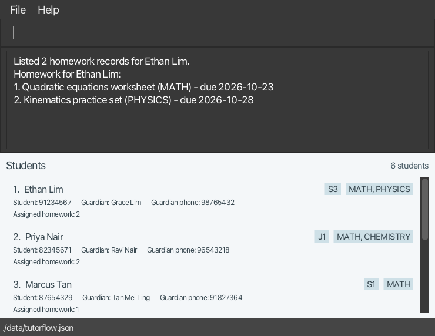
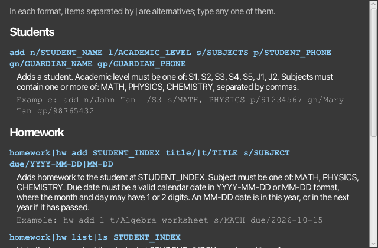

AddressBook Level 3 (AB3) is a **desktop application for managing contacts, optimized for use through a Command Line Interface (CLI)** while retaining the benefits of a Graphical User Interface (GUI). If you type quickly, AB3 can help you manage contacts faster than traditional GUI applications.

* Table of Contents
{:toc}

--------------------------------------------------------------------------------------------------------------------

## Quick start

1. Ensure that Java `25` or later is installed on your computer. 
   **Mac users:** Ensure you have the precise JDK version prescribed [here](https://se-education.org/guides/tutorials/javaInstallationMac.html).

1. Download the latest `.jar` file from [here](https://github.com/se-edu/addressbook-level3/releases).

1. Copy the file to the folder you want to use as the _home folder_ for your AddressBook.

1. Open a terminal, `cd` to the folder containing the JAR file, and run `java -jar addressbook.jar`. 
   A GUI similar to the one below should appear in a few seconds. Note how the app contains some sample data. 
   

1. Type a command in the command box and press Enter to execute it. For example, type **`help`** and press Enter to open the help window. 
   Some example commands you can try:

   * `list` : Lists all contacts.

   * `add n/John Doe p/98765432 e/johnd@example.com a/John street, block 123, #01-01` : Adds a contact named `John Doe` to the Address Book.

   * `delete 3` : Deletes the 3rd contact shown in the current list.

   * `clear` : Deletes all contacts.

   * `exit` : Exits the app.

1. Refer to the [Features](#features) section below for details of each command.

--------------------------------------------------------------------------------------------------------------------

## Features

**:information_source: Notes about the command format:** 

* Words in `UPPER_CASE` are the parameters to be supplied by the user. 
  For example, in `add n/NAME`, replace `NAME` with a value such as `John Doe`.

* Items in square brackets are optional. 
  For example, `n/NAME [t/TAG]` can be used as `n/John Doe t/friend` or as `n/John Doe`.

* Items separated by `|` are alternatives; type any one of them. 
  For example, `homework|hw list|ls STUDENT_INDEX` can be used as `homework list 1` or as `hw ls 1`.

* Items followed by `…`​ can appear zero or more times. 
  For example, `[t/TAG]…​` may be omitted, or written as `t/friend` or `t/friend t/family`.

* Parameters can be in any order. 
  For example, if the command specifies `n/NAME p/PHONE_NUMBER`, `p/PHONE_NUMBER n/NAME` is also acceptable.

* Extraneous parameters for commands that take no parameters, such as `help`, `list`, `exit`, and `clear`, are ignored. 
  For example, `help 123` is interpreted as `help`.

* If you are using a PDF version of this document, be careful when copying and pasting commands that span multiple lines as space characters surrounding line-breaks may be omitted when copied over to the application.

### Viewing help: `help`

Shows a message explaining how to access the help page.

Format: `help`

### Adding a person: `add`

Adds a person to the address book.

Format: `add n/NAME p/PHONE_NUMBER e/EMAIL a/ADDRESS [t/TAG]…​`

:bulb: **Tip:**
A person can have any number of tags, including zero.

Examples:
* `add n/John Doe p/98765432 e/johnd@example.com a/John street, block 123, #01-01`
* `add n/Betsy Crowe t/friend e/betsycrowe@example.com a/Newgate Prison p/1234567 t/criminal`

### Listing all persons: `list`

Shows a list of all persons in the address book.

Format: `list`

### Editing a person: `edit`

Edits an existing person in the address book.

Format: `edit INDEX [n/NAME] [p/PHONE] [e/EMAIL] [a/ADDRESS] [t/TAG]…​`

* Edits the person at the specified `INDEX`. The index refers to the index number shown in the displayed person list. The index **must be a positive integer** 1, 2, 3, …​
* At least one of the optional fields must be provided.
* Existing values will be updated to the input values.
* When editing tags, all of the person's existing tags are removed; adding tags is not cumulative.
* To remove all of a person's tags, enter `t/` without a tag after it.

Examples:
*  `edit 1 p/91234567 e/johndoe@example.com` Edits the phone number and email address of the 1st person to be `91234567` and `johndoe@example.com` respectively.
*  `edit 2 n/Betsy Crower t/` Edits the name of the 2nd person to be `Betsy Crower` and clears all existing tags.

### Locating persons by name: `find`

Finds persons whose names contain any of the given keywords.

Format: `find KEYWORD [MORE_KEYWORDS]`

* The search is case-insensitive; for example, `hans` matches `Hans`.
* Keyword order does not matter; for example, `Hans Bo` matches `Bo Hans`.
* The search considers only names.
* Only full words match; for example, `Han` does not match `Hans`.
* Persons matching at least one keyword are returned (an `OR` search); for example, `Hans Bo` returns `Hans Gruber` and `Bo Yang`.

Examples:
* `find John` returns `john` and `John Doe`
* `find alex david` returns `Alex Yeoh`, `David Li` 
  

### Deleting a person: `delete`

Deletes the specified person from the address book.

Format: `delete INDEX`

* Deletes the person at the specified `INDEX`.
* The index refers to the index number shown in the displayed person list.
* The index **must be a positive integer** 1, 2, 3, …​

Examples:
* `list` followed by `delete 2` deletes the 2nd person in the address book.
* `find Betsy` followed by `delete 1` deletes the 1st person in the results of the `find` command.

### Adding homework to a student: `homework add`

Adds a homework record to the end of a student's homework list.

Format: `homework|hw add STUDENT_INDEX title/|t/TITLE s/SUBJECT due/YYYY-MM-DD|MM-DD`

* `homework` can be shortened to `hw`, and `title/` can be shortened to `t/`.
* `STUDENT_INDEX` refers to the index number shown in the displayed student list. It **must be a positive whole number without leading zeroes**, such as 1, 2, 3, …​
* `TITLE` must be 1 to 100 characters long and must not contain line breaks or control characters (such as tabs). Extra spaces are removed, and capitalization is kept.
* A lowercase word directly followed by `/` in `TITLE` (such as `km/h` or `and/or`) is read as a prefix, so the command is rejected. Write such words with a capital letter or with spaces around the `/` instead, e.g. `And/or`, `and / or` or `km / h`.
* `SUBJECT` must be `MATH`, `PHYSICS` or `CHEMISTRY` (in any case), and the student must take that subject.
* The due date must be a real calendar date in `YYYY-MM-DD` format. Past dates are accepted, so you can record homework that was assigned earlier.
* The due date can also be given as `MM-DD`. The year is then this year, or next year if that date has already passed this year, and the result shows the year used.
* In both formats, the month and day may have 1 or 2 digits, so `2026-2-5` means 5 February 2026 and `10-5` means 5 October. The year must have 4 digits.
* A student cannot have two homework records with the same title (ignoring case), subject and due date. The same homework can be added to different students.
* Each student card shows the number of homework records that are still assigned.

:exclamation: **Caution:**
Like students, homework is kept in memory only for now. It is not saved and is lost when you close TutorFlow. Each time TutorFlow starts, the student list holds the same sample students with sample homework, which you can try the homework commands on.

Examples:
* `homework add 1 title/Complete algebra worksheet s/MATH due/2026-10-15`
* `hw add 1 t/Attempt mechanics questions 1-5 s/PHYSICS due/2026-10-20`
* `homework add 2 due/10-18 s/chemistry title/Revise atomic structure` adds homework due on 18 October of this year, or of next year if 18 October has passed.
* `hw add 1 t/Read chapter 3 s/physics due/10-5` adds homework due on 5 October of this year, or of next year if 5 October has passed.

### Listing a student's homework: `homework list`

Shows all homework of a student in the order it was added, numbered from 1.

Format: `homework|hw list|ls STUDENT_INDEX`

* `homework` can be shortened to `hw`, and `list` can be shortened to `ls`.
* `STUDENT_INDEX` follows the same rules as in `homework add`.
* Each homework is shown on one line as its number, title, subject and due date, e.g. `1. Complete algebra worksheet (MATH) - due 2026-10-15`.
* The numbers shown are the `HOMEWORK_INDEX` values used by `homework delete`. They change when homework is deleted.

Examples:
* `homework list 1`
* `hw ls 3`

### Deleting a student's homework: `homework delete`

Deletes one homework record from a student.

Format: `homework|hw delete|del STUDENT_INDEX HOMEWORK_INDEX`

* `homework` can be shortened to `hw`, and `delete` can be shortened to `del`.
* `STUDENT_INDEX` follows the same rules as in `homework add`.
* `HOMEWORK_INDEX` refers to the number shown by `homework list STUDENT_INDEX`. It **must be a positive whole number without leading zeroes**.
* The remaining homework keeps its order and is renumbered.
* Deletion cannot be undone.

Examples:
* `homework list 1` followed by `homework delete 1 2` deletes the 2nd homework of the 1st student.
* `hw del 3 1`

### Clearing all entries: `clear`

Clears all entries from the address book.

Format: `clear`

### Exiting the program: `exit`

Exits the program.

Format: `exit`

### Saving the data

AddressBook automatically saves data after every command. You do not need to save manually.

### Editing the data file

AddressBook data is saved automatically as a JSON file `[JAR file location]/data/addressbook.json`. Advanced users are welcome to update data directly by editing that data file.

:exclamation: **Caution:**
If your changes make the data file invalid, AddressBook starts with an empty address book at the next run. The invalid file remains on disk until you run a command (AddressBook saves after every command). Still, we recommend backing up the file before editing it. 
Furthermore, certain edits can cause the AddressBook to behave in unexpected ways (e.g., if a value entered is outside of the acceptable range). Therefore, edit the data file only if you are confident that you can update it correctly.

### Archiving data files `[coming in v2.0]`

_Details coming soon ..._

--------------------------------------------------------------------------------------------------------------------

## FAQ

**Q**: How do I transfer my data to another computer? 
**A**: Install the app on the other computer and overwrite the data file it creates with the data file from your previous AddressBook home folder.

--------------------------------------------------------------------------------------------------------------------

## Known issues

1. **When using multiple screens**, if you move the application to a secondary screen, and later switch to using only the primary screen, the GUI will open off-screen. The remedy is to delete the `preferences.json` file created by the application before running the application again.
2. **If you minimize the Help Window** and then run the `help` command (or use the `Help` menu, or the keyboard shortcut `F1`) again, the original Help Window will remain minimized, and no new Help Window will appear. The remedy is to manually restore the minimized Help Window.

--------------------------------------------------------------------------------------------------------------------

## Command summary

Action | Format, Examples
--------|------------------
**Add** | `add n/NAME p/PHONE_NUMBER e/EMAIL a/ADDRESS [t/TAG]…​`   e.g., `add n/James Ho p/22224444 e/jamesho@example.com a/123, Clementi Rd, 1234665 t/friend t/colleague`
**Clear** | `clear`
**Delete** | `delete INDEX`  e.g., `delete 3`
**Edit** | `edit INDEX [n/NAME] [p/PHONE_NUMBER] [e/EMAIL] [a/ADDRESS] [t/TAG]…​`  e.g., `edit 2 n/James Lee e/jameslee@example.com`
**Find** | `find KEYWORD [MORE_KEYWORDS]`  e.g., `find James Jake`
**Homework add** | <code>homework&#124;hw add STUDENT_INDEX title/&#124;t/TITLE s/SUBJECT due/YYYY-MM-DD&#124;MM-DD</code>  e.g., `homework add 1 title/Complete algebra worksheet s/MATH due/2026-10-15`
**Homework delete** | <code>homework&#124;hw delete&#124;del STUDENT_INDEX HOMEWORK_INDEX</code>  e.g., `homework delete 1 2`
**Homework list** | <code>homework&#124;hw list&#124;ls STUDENT_INDEX</code>  e.g., `homework list 1`
**List** | `list`
**Help** | `help`
